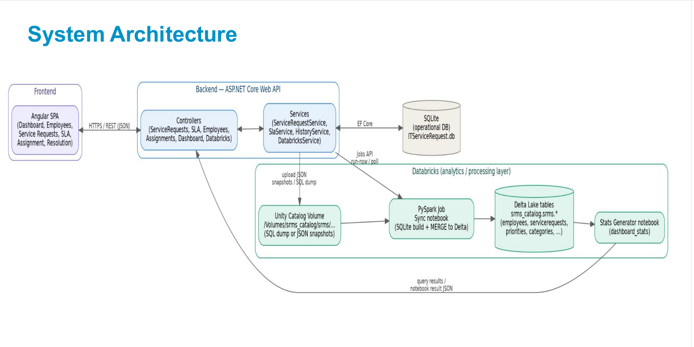
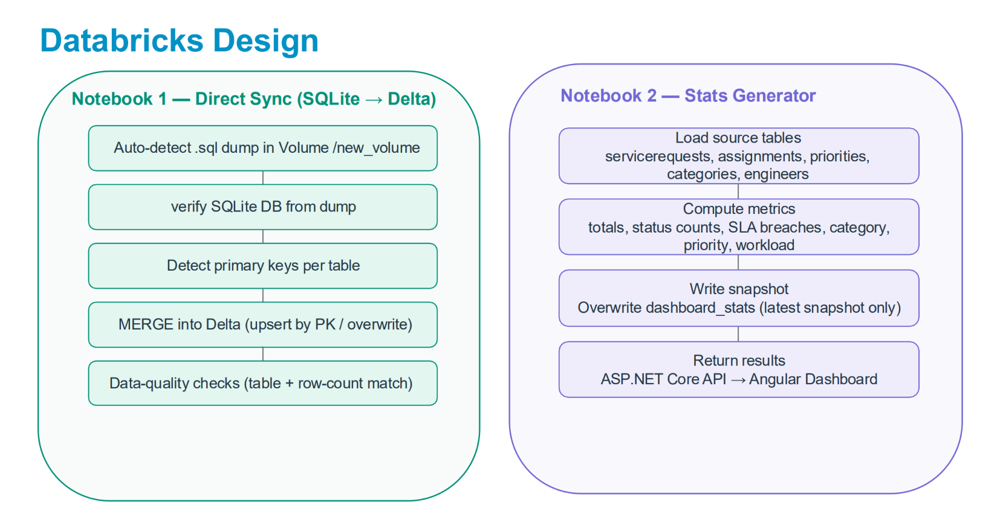
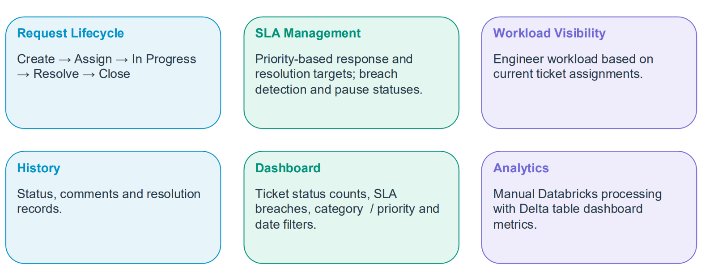

# IT Service Request Management System 

A web-based application for employees to raise IT support requests 
and for support engineers to categorize, assign, track, resolve and 
close those requests.
The system will include SLA tracking, request 
history, workload visibility, and dashboards.
A PySpark job in Databricks triggered manually to process
the underlying employee, catalog data stored
in delta tables , and returns the results back to the frontend
for display

## Structure

- `frontend/` - Angular application
- `backend/` - ASP.NET Core API
- `database/` - SQLite database files


<p align="center">
  
</p>


<p align="center">
  
</p>
  

## Functional flow

Create Request -> New -> Assign Active Engineer -> Assigned -> In Progress -> Resolve -> Resolved -> Confirm & Close -> Closed


**Features Implemented**

<p align="center">
  
</p>

## Dashboard & Reports

- Open / In Progress / Resolved / Closed counts
- SLA-breached tickets
- Tickets by priority and category
- Engineer workload
- Basic filtering

## Run backend

From `backend`:

```powershell
dotnet restore
dotnet build
dotnet run --launch-profile http
```

The HTTP profile uses `http://localhost:5103`.

## Run frontend

From `frontend`:

```powershell
npm install --legacy-peer-deps
npm start
```

Open the Angular URL shown by the CLI, normally `http://localhost:4200`.

Use a supported Node.js version for the Angular CLI version specified in `frontend/package.json`.

## Main routes

- `/dashboard`
- `/employees`
- `/service-catalog`
- `/service-requests`
- `/service-requests/new`
- `/service-requests/:id`
- `/sla`
- `/assignment`
- `/resolution-closure`

**Conclusion**

The solution combines an Angular frontend, ASP.NET Core Web API, SQLite operational database and Databricks analytics layer.​
It supports service-request lifecycle management, SLA management, assignment, resolution, history and dashboard reporting.​
The documented demonstration flow completes the journey from employee ticket creation through closure, with dashboard and history updates.​

​
